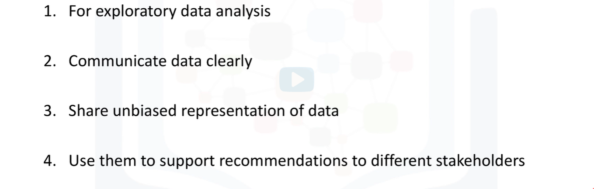
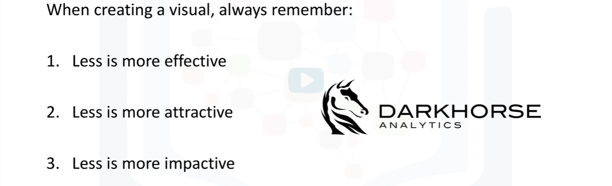
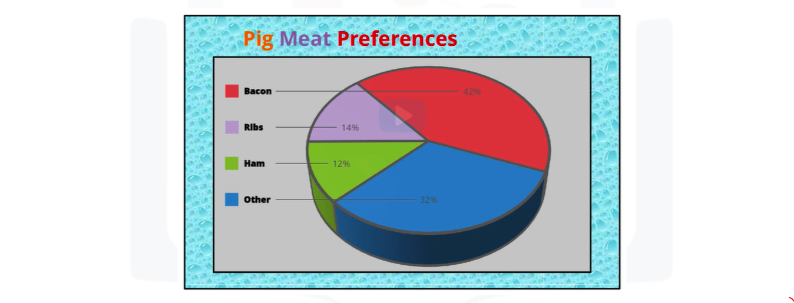
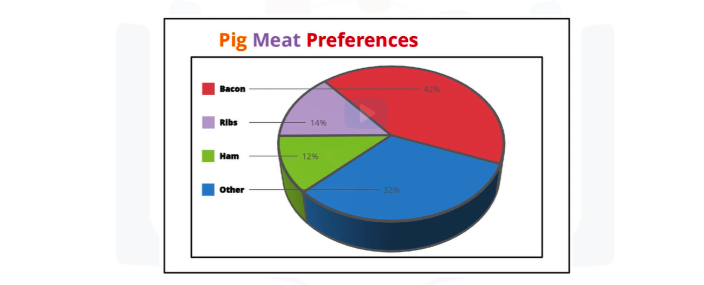
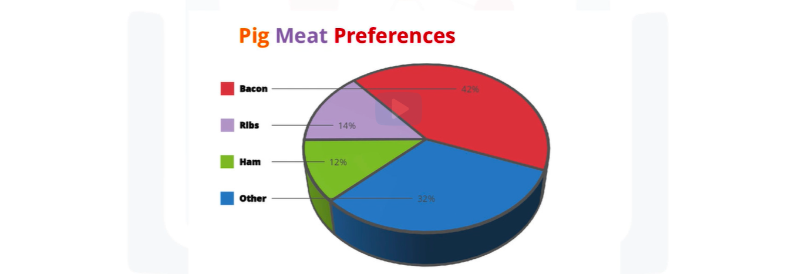
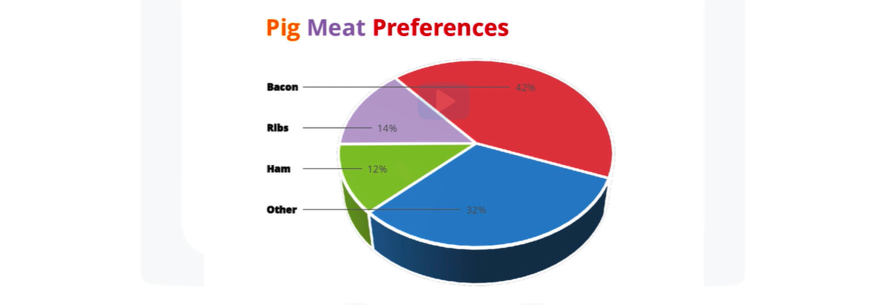

# Data Visualization with Python

## Learning Objectives
In this course you will learn about:
* Data visualization and some of the best practices when creating plots and visuals.
* The history and architecture of Matplotlib, and how to do basic plotting with Matplotlib.
* Generating different visualization tools using Matplotlib such as line plots, area plots, histograms, bar charts, box plots, and pie charts.
* Seaborn, another data visualization library in Python, and how to use it to create attractive statistical graphics.
* Folium, and how to use to create maps and visualize geospatial data.
## Syllabus 
### Module 1 - Introduction to Visualization Tools
* Introduction to Data Visualization
* Introduction to Matplotlib
* Basic Plotting with Matplotlib
* Dataset on Immigration to Canada
* Line Plots
### Module 2 - Basic Visualization Tools
* Area Plots
* Histograms
* Bar Charts
### Module 3 - Specialized Visualization Tools
* Pie Charts
* Box Plots
* Scatter Plots
* Bubble Plots
### Module 4 - Extra Visualization Tools
* Waffle Charts
* Word Clouds
* Seaborn and Regression Plots
### Module 5 - Creating Maps and Visualizing Geospatial Data
* Introduction to Folium and Map Styles
* Maps with Markers 
* Choropleth Maps
## Module 1 - Introduction to Visualization Tools
### Learning Objectives
In this lesson you will learn about:
* Data visualization and some of the best practices to keep in mind when creating plots and visuals.
* The history and the architecture of Matplotlib.
* Basic plotting with Matplotlib.
* The dataset on immigration to Canada, which will be used extensively throughout the course.
* Generating line plots using Matplotlib.
### Introduction to Data Visualization
#### Why Build Visuals ?

### Best Practices

### Example

### Example - Remove Background

### Example - Remove Border

### Example - Remove Redundant Legend

### Example - Remove 3D

### Example - Remove Text Bolding
