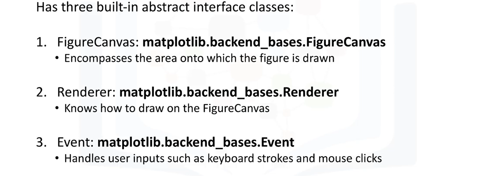
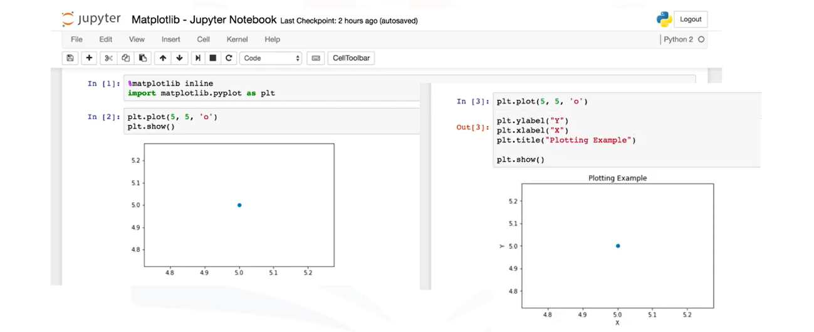
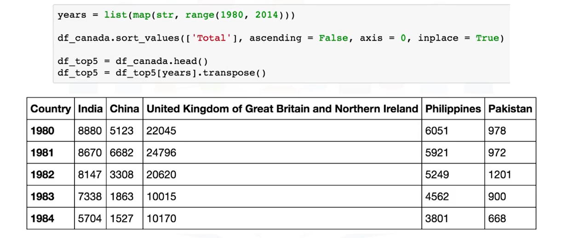

# Data Visualization with Python

## Learning Objectives
In this course you will learn about:
* Data visualization and some of the best practices when creating plots and visuals.
* The history and architecture of Matplotlib, and how to do basic plotting with Matplotlib.
* Generating different visualization tools using Matplotlib such as line plots, area plots, histograms, bar charts, box plots, and pie charts.
* Seaborn, another data visualization library in Python, and how to use it to create attractive statistical graphics.
* Folium, and how to use to create maps and visualize geospatial data.
## Syllabus 
### Module 1 - Introduction to Visualization Tools
* Introduction to Data Visualization
* Introduction to Matplotlib
* Basic Plotting with Matplotlib
* Dataset on Immigration to Canada
* Line Plots
### Module 2 - Basic Visualization Tools
* Area Plots
* Histograms
* Bar Charts
### Module 3 - Specialized Visualization Tools
* Pie Charts
* Box Plots
* Scatter Plots
* Bubble Plots
### Module 4 - Extra Visualization Tools
* Waffle Charts
* Word Clouds
* Seaborn and Regression Plots
### Module 5 - Creating Maps and Visualizing Geospatial Data
* Introduction to Folium and Map Styles
* Maps with Markers 
* Choropleth Maps
## Module 1 - Introduction to Visualization Tools
### Learning Objectives
In this lesson you will learn about:
* Data visualization and some of the best practices to keep in mind when creating plots and visuals.
* The history and the architecture of Matplotlib.
* Basic plotting with Matplotlib.
* The dataset on immigration to Canada, which will be used extensively throughout the course.
* Generating line plots using Matplotlib.
### Introduction to Data Visualization
#### Why Build Visuals ?

### Best Practices

### Example

### Example - Remove Background

### Example - Remove Border

### Example - Remove Redundant Legend

### Example - Remove 3D

### Example - Remove Text Bolding

### Example - Reduce Color

### Example - Remove Wedges

### Example - Thicken Lines

### Example - Emphasize Bacon

### Comparaison

### More Examples

[https://www.darkhorseanalytics.com/](https://www.darkhorseanalytics.com/)
### Introduction to Matplotlib
#### Matplotlib - History

#### Matplotlib - Archictecture

### Backend Layer

### Artist Layer

### Putting the Artist Layer to Use

### Scripting Layer

### Further Reading

[https://aosabook.org/en/matplotlib.html](https://aosabook.org/en/matplotlib.htm)
### Basic Plotting with Matplotlib
### Matplotlib - Jupyter Notebook
Jupyter notebook is open source web application that allows you to create and share documents that contain live code visualizations and some explonatory text as well. Jupyter has some specialized support for Matplotlib

### Matplotlib - Plot Function
In this cours, you can already create visuals tools such as:
* histograms
* bar charts
* box plots
* and any more using one function **Plot**
### Matplotlib - Backends - inline
magic function **%matplotlib inline**, the limitation of this backend is we can not modify figure when it is rendered.

### Matplotlib - Backends - Notebook
With a notebook backend in place, if a plt function is called, it checks if an active figure exists, and any functions you call will be applied to this active figure. If figure does not exist, it renders a news figure.

### Matplotlib - Pandas
Pandas is also a built-in implementation of it. there, plotting in pandas is as simple as calling the plot function on a given pandas series or dataframe.
#### Matplotlib - Pandas - Line

#### Matplotlib - Pandas - Histogram

### Dataset on Immigration to Canada
#### Dataset

#### Immigration Data to Canada

#### Read Data into Pandas DataFrame

#### Display DataFrame

### Line Plots

### Dataset - Recap

### Dataset - Precessed

### Creating Line Plot

## Module 2 - Basic Visualization Tools
### Learning Objectives
In this lesson you will learn about:
* Area plots, and how to create them with Matplotlib.
* Histograms, and how to create them with Matplotlib.
* Bar charts, and how to create them with Matplotlib.
### Area Plots 

### Dataset - Recap

### Dataset - Processed

### Generating Area Plots

### Area Plots

### Histograms

### Dataset Recap

### Dataset - Processed

### Histograms

### Numpy - Histograms

### Bar Charts

### Dataset - Recap

### Dataset - Processed

### Bar Chart

## Module 3 - Specialized Visualization Tools
### Learning Objectives
In this lesson you will learn about:
* Pie charts, and how to create them with Matplotlib.
* Box plots, and how to create them with Matplotlib.  
* Scatter plots and bubble plots, and how to create them with Matplotlib.
### Pie Charts

### Dataset - Recap

### Dataset - Processed

### Pie Chart 

### Outcomes

### Pie Charts Flows

[https://www.surveygizmo.com/survey-blog/pie-chart-or-bar-graph](https://www.surveygizmo.com/survey-blog/pie-chart-or-bar-graph/)
### Box Plots

### Dataset - Recap

### Dataset - Processed

### Box Plots
